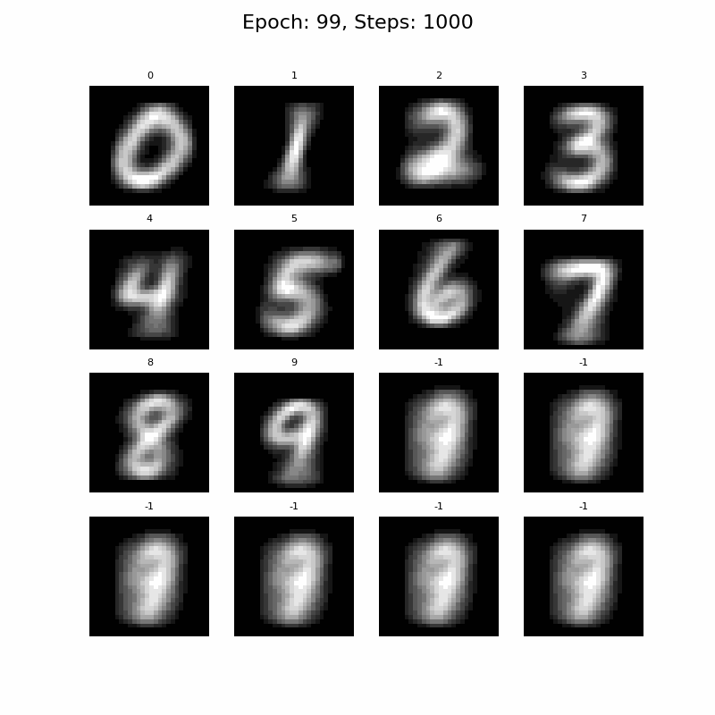

# bayesian-flow-mnist

A simple <a href="https://arxiv.org/abs/2308.07037">Bayesian Flow</a> model for MNIST in Pytorch.

- [x] Binarised MNIST generation using Bayesian Flow Discrete Data Loss
- [ ] Continuous MNIST generation using Bayesian Flow Continuous Data Loss

## How to Run

### Environment Setup

Aside from `pytorch`, `matplotlib`, and `tqdm`, the training script requires
<a href="https://github.com/thorinf/bayesian-flow-pytorch">bayesian-flow-pytorch</a>.

```commandline
pip install git+https://github.com/thorinf/bayesian-flow-pytorch
```

### Training

The model can be trained with the following command and MNIST will download automatically:

```terminal
python train.py -ckpt CHECKPOINTING_PATH -d MNIST_DOWNLOAD_PATH
```

### Experiments

#### Binarised MNIST

This method considers the pixel intensities as Bernoulli probabilities, 
think of this like the likelihood of it being the likelihood of something being true.
Since the pixel values can be interpreted as probabilities, 
the task can be trained on the Bayesian Flow discrete data loss. 

The sampling method will then return a shape which matches MNIST spatial dimensions and a final probaility dimension.
The final dimension will contain two probabilities; probability of pixel on/high, and the probability of pix off/low.
So convert this back to pixel intensity we can just take the channel indicating pixel on/high.

<p align="center">
  
  <br>Binarised MNIST sampling after 100 epochs of training, using 1000 sampling steps.
</p>

