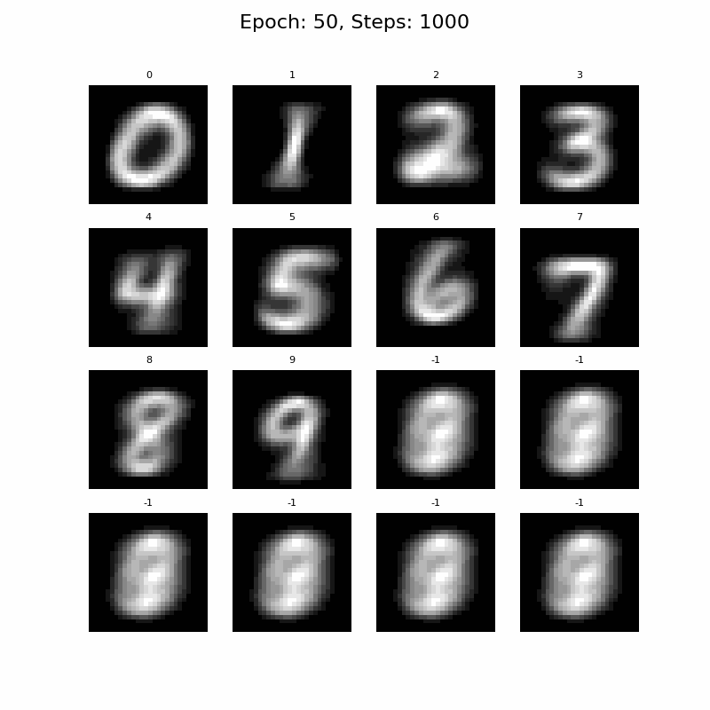
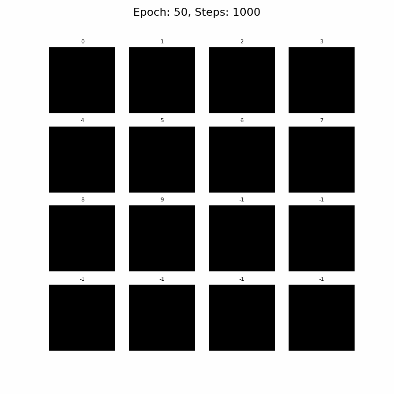

# bayesian-flow-mnist

A simple <a href="https://arxiv.org/abs/2308.07037">Bayesian Flow</a> model for MNIST in Pytorch.

- [x] Binarised MNIST generation using Bayesian Flow Discrete Data Loss
- [x] Continuous MNIST generation using Bayesian Flow Continuous Data Loss

This implementation could definitely be factorised, or include more features, 
but the intention is to make something minimal.

## How to Run

### Environment Setup

Aside from `pytorch`, `matplotlib`, and `tqdm`, the training script requires
<a href="https://github.com/thorinf/bayesian-flow-pytorch">bayesian-flow-pytorch</a>.

```commandline
pip install git+https://github.com/thorinf/bayesian-flow-pytorch
```

### Training

The model can be trained with the following command and MNIST will download automatically:

```terminal
python train.py -ckpt CHECKPOINTING_PATH -d MNIST_DOWNLOAD_PATH
```

### Experiments

#### Binarised MNIST

This method considers the pixel intensities as Bernoulli probabilities, 
think of this like the likelihood of it being the likelihood of something being true.
Since the pixel values can be interpreted as probabilities, 
the task can be trained on the Bayesian Flow discrete data loss. 

The sampling method will then return a shape which matches MNIST spatial dimensions and a final probaility dimension.
The final dimension will contain two probabilities; probability of pixel on/high, and the probability of pix off/low.
So convert this back to pixel intensity we can just take the channel indicating pixel on/high.

Although this isn't a strategy that's come to be expected from generative image models, 
in this case it works extremely well. 
In fact, the results at 20 epochs of training are nearly as good as the continuous methodology after 50.

<p align="center">
  
  <br>Binarised MNIST sampling after 50 epochs of training, using 1000 sampling steps, '-1' unconditional generation.
</p>

#### Continuous MNIST

This is a more typical generative method for MNIST. The data is scaled to be [-1,1], and nothing more.
This part of the implementation is experimental, and, as you can see below, the results could be improved.
Trying different values of sigma, or dropout, may yield a better generation. Note, a sigma value of 0.01 resulted 
in the loss being NaN about halfway through training. 

<p align="center">
  
  <br>Continuous MNIST sampling after 50 epochs of training, using 1000 sampling steps, '-1' unconditional generation.
</p>

